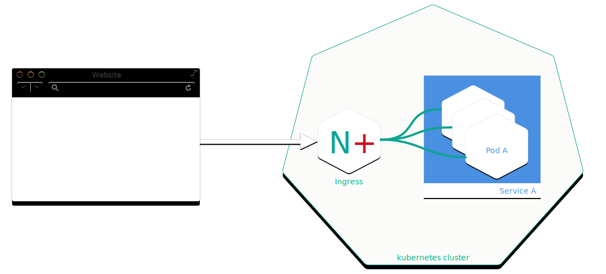

## Problem

**After updating your HTML and JavaScript sources in your web application, 
the kubernetes cluster delivers outdated versions - why?**

## Preamble
By default, Kubernetes service pods are not accessible from the external 
network, but only from other pods within the same Kubernetes cluster. 

The Gardener cluster has a built-in configuration for HTTP load balancing called **Ingress**, 
defining rules for external connectivity to Kubernetes services. Users who want external access 
to their Kubernetes services create an ingress resource that defines rules, 
including the URI path, backing service name, and other information. The Ingress controller 
can then automatically program a frontend load balancer to enable Ingress configuration.




## Example Ingress Configuration

```yaml
apiVersion: networking.k8s.io/v1beta1
kind: Ingress
metadata:
  name: vuejs-ingress
spec:
  rules:
  - host: test.ingress.<GARDENER-CLUSTER>.<GARDENER-PROJECT>.shoot.canary.k8s-hana.ondemand.com
    http:
      paths:
      - backend:
          serviceName: vuejs-svc
          servicePort: 8080
```
where:
 - **&lt;GARDENER-CLUSTER&gt;**: The cluster name in the Gardener
 - **&lt;GARDENER-PROJECT&gt;**: You project name in the Gardener


## What is the underlying problem?

The ingress controller we are using is **NGINX**.

> NGINX  is a software load balancer, web server, and **content cache** built on top of open 
source NGINX.


**NGINX caches the content as specified in the HTTP header.** If the HTTP header is missing, 
it is assumed that the cache is **forever** and NGINX never updates the content in the 
stupidest case.

## Solution
In general you can avoid this pitfall with one of the solutions below:

 - use a cache buster + HTTP-Cache-Control(prefered)
 - use HTTP-Cache-Control with a lower retention period
 - disable the caching in the ingress (just for dev purpose)
 
Learning how to set the HTTP header or setup a cache buster is left to the read as an exercise
for your web framework (e.g. Express/NodeJS, SpringBoot,...)

Here an example how to disable the cache control for your ingress done with an annotation in your
 ingress YAML (during development).
 
```yaml
---
apiVersion: networking.k8s.io/v1beta1
kind: Ingress
metadata:
  annotations:
    ingress.kubernetes.io/cache-enable: "false"
  name: vuejs-ingress
spec:
  rules:
  - host: test.ingress.<GARDENER-CLUSTER>.<GARDENER-PROJECT>.shoot.canary.k8s-hana.ondemand.com
    http:
      paths:
      - backend:
          serviceName: vuejs-svc
          servicePort: 8080
```
